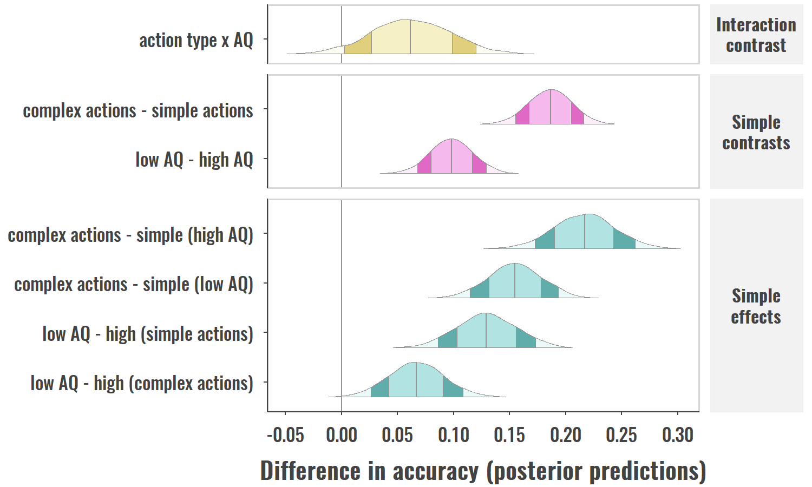
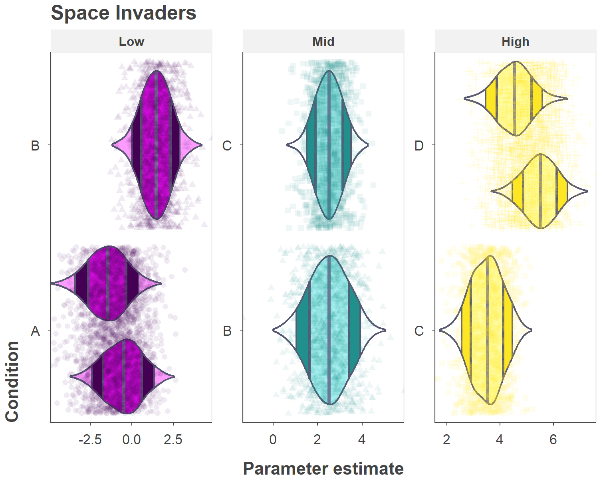
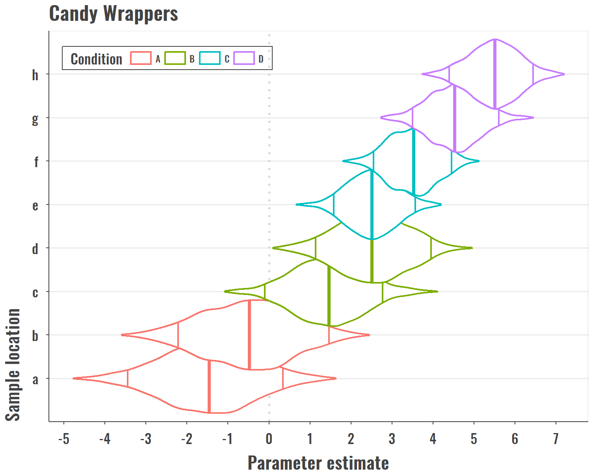

<!-- README.md is generated from README.Rmd. Please edit that file -->

[](https://cran.r-project.org/package=ggdistribute)

# ggdistribute

A `ggplot2` Extension for Plotting Unimodal Distributions

The `ggdistribute` package is an extension for plotting posterior or
other types of unimodal distributions that require overlaying
information about a distribution’s intervals. It makes use of the
`ggproto` system to extend `ggplot2`, providing additional “geoms”,
“stats”, and “positions.” The extensions integrate with existing
`ggplot2` layer elements.

## Example

The package function `example_plot()` is an overview of combining
`ggdistribute` with other `ggplot2` elements. The contents of this
function are printed below and gives details about the extended parts to
`ggplot2`.

``` r
library(ggplot2)
library(ggdistribute)
```

    #> Warning in grid.Call(C_textBounds, as.graphicsAnnot(x$label), x$x, x$y, :
    #> font family not found in Windows font database
    
    #> Warning in grid.Call(C_textBounds, as.graphicsAnnot(x$label), x$x, x$y, :
    #> font family not found in Windows font database
    
    #> Warning in grid.Call(C_textBounds, as.graphicsAnnot(x$label), x$x, x$y, :
    #> font family not found in Windows font database
    
    #> Warning in grid.Call(C_textBounds, as.graphicsAnnot(x$label), x$x, x$y, :
    #> font family not found in Windows font database
    #> Warning in grid.Call.graphics(C_text, as.graphicsAnnot(x$label), x$x,
    #> x$y, : font family not found in Windows font database
    #> Warning in grid.Call(C_textBounds, as.graphicsAnnot(x$label), x$x, x$y, :
    #> font family not found in Windows font database
    
    #> Warning in grid.Call(C_textBounds, as.graphicsAnnot(x$label), x$x, x$y, :
    #> font family not found in Windows font database



``` r
example_plot <-
function() {
  # color palette
  colors <- mejr_palette()

  ggplot(sre_data(5000), aes_string(y="effect")) +

    # ggdistribute specific elements -------------------------------------------
    geom_posterior(
      # ~~~~~~~~~~~~~~~~~~~~~~~~~~~~~~~~~~~~~~~~~~~~~~~~~~~~~~~~~~~~~~~~~~~~~~~~
      # geom_posterior() aesthetics mappings
      # ~~~~~~~~~~~~~~~~~~~~~~~~~~~~~~~~~~~~~~~~~~~~~~~~~~~~~~~~~~~~~~~~~~~~~~~~
      aes_string(x="value", fill="contrast"),
      # ~~~~~~~~~~~~~~~~~~~~~~~~~~~~~~~~~~~~~~~~~~~~~~~~~~~~~~~~~~~~~~~~~~~~~~~~
      # options passed to stat_density_ci() for estimating intervals
      # ~~~~~~~~~~~~~~~~~~~~~~~~~~~~~~~~~~~~~~~~~~~~~~~~~~~~~~~~~~~~~~~~~~~~~~~~
      interp_thresh=.001, # threshold for interpolating segment gaps
      center_stat="median", # measure of central tendency
      ci_width=0.90, # width corresponding to CI segments
      interval_type="ci", # quantile intervals not highest density interval
      # ~~~~~~~~~~~~~~~~~~~~~~~~~~~~~~~~~~~~~~~~~~~~~~~~~~~~~~~~~~~~~~~~~~~~~~~~
      # options passed to stat_density_ci() for estimating density
      # ~~~~~~~~~~~~~~~~~~~~~~~~~~~~~~~~~~~~~~~~~~~~~~~~~~~~~~~~~~~~~~~~~~~~~~~~
      bw=".nrd0", # bandwidth estimator type
      adjust=1.5, # adjustment to bandwidth
      n=1024, # number of samples in final density
      trim=.005, # trim `x` this proportion before estimating density
      cut=1.5, # tail extension for zero density estimation
      # ~~~~~~~~~~~~~~~~~~~~~~~~~~~~~~~~~~~~~~~~~~~~~~~~~~~~~~~~~~~~~~~~~~~~~~~~
      # geom_posterior() options
      # ~~~~~~~~~~~~~~~~~~~~~~~~~~~~~~~~~~~~~~~~~~~~~~~~~~~~~~~~~~~~~~~~~~~~~~~~
      draw_ci=TRUE, # toggle showing confidence interval parts
      draw_sd=TRUE, # toggle showing standard deviation parts
      mirror=FALSE, # toggle horizontal violin distributions
      midline_color=NULL, # line displaying center of dist. (NULL=aes color)
      brighten=c(3, 0, 1.333), # additive adjustment of segment fill colors
      # ~~~~~~~~~~~~~~~~~~~~~~~~~~~~~~~~~~~~~~~~~~~~~~~~~~~~~~~~~~~~~~~~~~~~~~~~
      # position_spread() options
      # ~~~~~~~~~~~~~~~~~~~~~~~~~~~~~~~~~~~~~~~~~~~~~~~~~~~~~~~~~~~~~~~~~~~~~~~~
      position=position_spread(
        reverse=TRUE, # order of spreaded groups within panels
        padding=0.3, # shrink heights of distributions
        height="panel" # scale by heights within panels
      ), #
      # ~~~~~~~~~~~~~~~~~~~~~~~~~~~~~~~~~~~~~~~~~~~~~~~~~~~~~~~~~~~~~~~~~~~~~~~~
      # standard ggplot layer options
      # ~~~~~~~~~~~~~~~~~~~~~~~~~~~~~~~~~~~~~~~~~~~~~~~~~~~~~~~~~~~~~~~~~~~~~~~~
      size=0.15, color=colors$gray, vjust=0.7, show.legend=FALSE) +

    # standard ggplot2 elements ------------------------------------------------
    geom_vline(
      alpha=0.5, color=colors$gray, size=0.333, linetype=1,
      xintercept=0) + scale_x_continuous(breaks=seq(-1, 1, .05)) +
    facet_grid("contrast ~ .", scales="free_y", space="free_y") +
    scale_fill_manual(values=c(colors$yellow, colors$magenta, colors$cyan)) +
    labs(x="Difference in accuracy (posterior predictions)") +
    theme(
      legend.position="none", strip.text.y=element_text(angle=0, hjust=0.5),
      panel.border=element_rect(fill=NA, color=colors$lightgray, size=0.67),
      panel.grid=element_blank(), panel.ontop=FALSE, axis.title.y=element_blank(),
      plot.margin=margin(t=2, r=4, b=2, l=2, unit="pt"))
}
```

The `data` object below is a randomly generated dataset of 5 different
normal distributions. Two factors `Condition` and `Group` are assigned
according to the generated values. 1000 samples are generated for each
value of `mu`.

``` r
data <- data_normal_sample(mu = c(-1, 2, 3, 5), n = 2500)
```

``` r
# create new grouping variable from `Group`
# R version >= 3.5 now let's you assign factors this way.
data$Level <- with(data, factor(Group,
  levels = letters[1:8],
  labels = c(
    rep("Low", 3), rep("Mid", 2),
    rep("High", 3)), ordered = TRUE))
```

Unique groups per `Group`, `Condition`, and `Level`.

``` r
unique(data[, c("Group", "Condition", "Level")])
#> # A tibble: 8 x 3
#>   Group Condition Level
#>   <chr> <chr>     <ord>
#> 1 a     A         Low  
#> 2 b     A         Low  
#> 3 c     B         Low  
#> 4 d     B         Mid  
#> 5 e     C         Mid  
#> 6 f     C         High 
#> 7 g     D         High 
#> 8 h     D         High
```

### Facetting and spreading groups

``` r
ggplot(data) +
  aes(x = value, y = Condition, group = Group) +
  geom_posterior(
    aes(fill = Level),
    mirror = TRUE,
    show.legend = FALSE,
    adjust = 1.5,
    position = position_spread(reverse = TRUE)) +
  geom_point(
    aes(color = Level, shape = Condition),
    alpha = .08,
    fill = NA,
    show.legend = FALSE,
    position = position_jitter(0, .45)) +
  coord_cartesian(
    ylim = c(0.5, 2.5),
    expand = FALSE) +
  facet_wrap(
    ~Level,
    scales = "free") +
  labs(
    title = "Space Invaders",
    y = "Condition",
    x = "Parameter estimate")
#> Warning in grid.Call(C_textBounds, as.graphicsAnnot(x$label), x$x, x$y, :
#> font family not found in Windows font database

#> Warning in grid.Call(C_textBounds, as.graphicsAnnot(x$label), x$x, x$y, :
#> font family not found in Windows font database

#> Warning in grid.Call(C_textBounds, as.graphicsAnnot(x$label), x$x, x$y, :
#> font family not found in Windows font database

#> Warning in grid.Call(C_textBounds, as.graphicsAnnot(x$label), x$x, x$y, :
#> font family not found in Windows font database

#> Warning in grid.Call(C_textBounds, as.graphicsAnnot(x$label), x$x, x$y, :
#> font family not found in Windows font database

#> Warning in grid.Call(C_textBounds, as.graphicsAnnot(x$label), x$x, x$y, :
#> font family not found in Windows font database

#> Warning in grid.Call(C_textBounds, as.graphicsAnnot(x$label), x$x, x$y, :
#> font family not found in Windows font database

#> Warning in grid.Call(C_textBounds, as.graphicsAnnot(x$label), x$x, x$y, :
#> font family not found in Windows font database

#> Warning in grid.Call(C_textBounds, as.graphicsAnnot(x$label), x$x, x$y, :
#> font family not found in Windows font database
#> Warning in grid.Call.graphics(C_text, as.graphicsAnnot(x$label), x$x,
#> x$y, : font family not found in Windows font database
#> Warning in grid.Call(C_textBounds, as.graphicsAnnot(x$label), x$x, x$y, :
#> font family not found in Windows font database

#> Warning in grid.Call(C_textBounds, as.graphicsAnnot(x$label), x$x, x$y, :
#> font family not found in Windows font database
#> Warning in grid.Call.graphics(C_text, as.graphicsAnnot(x$label), x$x,
#> x$y, : font family not found in Windows font database
#> Warning in grid.Call(C_textBounds, as.graphicsAnnot(x$label), x$x, x$y, :
#> font family not found in Windows font database
```



### Changing the appearance of `geom_posterior`

``` r
ggplot(data) +
  aes(x = value, y = Group) +
  geom_vline(
    xintercept = 0,
    size = .6) +
  geom_posterior(
    aes(color = Condition),
    midline_color = NULL,
    mirror = TRUE,
    fill = "#FFFFFF",
    draw_sd = FALSE,
    interval_type = "hdi",
    vjust = 0,
    position = position_spread(height = 2)) +
  labs(
    title = "Candy Wrappers",
    x = "Parameter estimate",
    y = "Sample location") +
  scale_x_continuous(breaks = seq(-10, 10, 1))+
  theme(
    legend.position = c(.025, .9),
    legend.justification = c(0, 0),
    panel.grid.major.y = element_line(color = gray(.92)))
#> Warning in grid.Call(C_textBounds, as.graphicsAnnot(x$label), x$x, x$y, :
#> font family not found in Windows font database

#> Warning in grid.Call(C_textBounds, as.graphicsAnnot(x$label), x$x, x$y, :
#> font family not found in Windows font database

#> Warning in grid.Call(C_textBounds, as.graphicsAnnot(x$label), x$x, x$y, :
#> font family not found in Windows font database

#> Warning in grid.Call(C_textBounds, as.graphicsAnnot(x$label), x$x, x$y, :
#> font family not found in Windows font database

#> Warning in grid.Call(C_textBounds, as.graphicsAnnot(x$label), x$x, x$y, :
#> font family not found in Windows font database

#> Warning in grid.Call(C_textBounds, as.graphicsAnnot(x$label), x$x, x$y, :
#> font family not found in Windows font database

#> Warning in grid.Call(C_textBounds, as.graphicsAnnot(x$label), x$x, x$y, :
#> font family not found in Windows font database

#> Warning in grid.Call(C_textBounds, as.graphicsAnnot(x$label), x$x, x$y, :
#> font family not found in Windows font database

#> Warning in grid.Call(C_textBounds, as.graphicsAnnot(x$label), x$x, x$y, :
#> font family not found in Windows font database

#> Warning in grid.Call(C_textBounds, as.graphicsAnnot(x$label), x$x, x$y, :
#> font family not found in Windows font database

#> Warning in grid.Call(C_textBounds, as.graphicsAnnot(x$label), x$x, x$y, :
#> font family not found in Windows font database

#> Warning in grid.Call(C_textBounds, as.graphicsAnnot(x$label), x$x, x$y, :
#> font family not found in Windows font database
#> Warning in grid.Call.graphics(C_text, as.graphicsAnnot(x$label), x$x,
#> x$y, : font family not found in Windows font database
#> Warning in grid.Call(C_textBounds, as.graphicsAnnot(x$label), x$x, x$y, :
#> font family not found in Windows font database

#> Warning in grid.Call(C_textBounds, as.graphicsAnnot(x$label), x$x, x$y, :
#> font family not found in Windows font database

#> Warning in grid.Call(C_textBounds, as.graphicsAnnot(x$label), x$x, x$y, :
#> font family not found in Windows font database
```



### The *y* axis is a repeated, continuous grouping variable

The variable `GroupScore` is a continuous variable assigned to each
`Group`. The distributions will be positioned at the start of the y
value for each group, and resized to not overlap with the next group.
Resizing can be overriden by specifying `height` in `position_spread`.

``` r
unique(data[, c("Group", "GroupScore")])
#> # A tibble: 8 x 2
#>   Group GroupScore
#>   <chr>      <dbl>
#> 1 a         -0.885
#> 2 b         -0.839
#> 3 c          2.18 
#> 4 d          2.33 
#> 5 e          2.81 
#> 6 f          3.07 
#> 7 g          4.90 
#> 8 h          4.93
```

``` r
ggplot(data) +
  aes(x = value, y = GroupScore) +
  geom_vline(
    xintercept = 0,
    size = .6) +
  geom_posterior(
    aes(fill = Group),
    midline_color = "#FFFFFF",
    colour = "#FFFFFF",
    alpha = 0.7,
    brighten = c(1.3, 0, -1.3),
    interval_type = "hdi",
    position = position_spread(
      height = 0.5,
      padding = 0)) +
  labs(
    title = "Rainbow Hills",
    x = "Parameter estimate",
    y = "Group's score") +
  scale_x_continuous(breaks = seq(-10, 10, 1))+
  scale_y_continuous(breaks = seq(-10, 10, .5))
#> Warning in grid.Call(C_textBounds, as.graphicsAnnot(x$label), x$x, x$y, :
#> font family not found in Windows font database

#> Warning in grid.Call(C_textBounds, as.graphicsAnnot(x$label), x$x, x$y, :
#> font family not found in Windows font database

#> Warning in grid.Call(C_textBounds, as.graphicsAnnot(x$label), x$x, x$y, :
#> font family not found in Windows font database

#> Warning in grid.Call(C_textBounds, as.graphicsAnnot(x$label), x$x, x$y, :
#> font family not found in Windows font database

#> Warning in grid.Call(C_textBounds, as.graphicsAnnot(x$label), x$x, x$y, :
#> font family not found in Windows font database

#> Warning in grid.Call(C_textBounds, as.graphicsAnnot(x$label), x$x, x$y, :
#> font family not found in Windows font database

#> Warning in grid.Call(C_textBounds, as.graphicsAnnot(x$label), x$x, x$y, :
#> font family not found in Windows font database

#> Warning in grid.Call(C_textBounds, as.graphicsAnnot(x$label), x$x, x$y, :
#> font family not found in Windows font database

#> Warning in grid.Call(C_textBounds, as.graphicsAnnot(x$label), x$x, x$y, :
#> font family not found in Windows font database

#> Warning in grid.Call(C_textBounds, as.graphicsAnnot(x$label), x$x, x$y, :
#> font family not found in Windows font database

#> Warning in grid.Call(C_textBounds, as.graphicsAnnot(x$label), x$x, x$y, :
#> font family not found in Windows font database

#> Warning in grid.Call(C_textBounds, as.graphicsAnnot(x$label), x$x, x$y, :
#> font family not found in Windows font database
#> Warning in grid.Call.graphics(C_text, as.graphicsAnnot(x$label), x$x,
#> x$y, : font family not found in Windows font database
#> Warning in grid.Call(C_textBounds, as.graphicsAnnot(x$label), x$x, x$y, :
#> font family not found in Windows font database

#> Warning in grid.Call(C_textBounds, as.graphicsAnnot(x$label), x$x, x$y, :
#> font family not found in Windows font database

#> Warning in grid.Call(C_textBounds, as.graphicsAnnot(x$label), x$x, x$y, :
#> font family not found in Windows font database
```


## How to install

### Dependencies

  - R: <https://www.r-project.org/>

A current R installation.

#### Dependencies for installing the development version of this package

  - `devtools` package:
    <https://www.rstudio.com/products/rpackages/devtools/>

The `devtools` package is an R package that makes it easier to install
local or remote content as an R package that can be used like any other
standard R package. You can install `devtools` by opening up RStudio or
an R terminal and running

``` r
install.packages("devtools")
```

For Windows users, you *may* be required to install Rtools first before
you can use the `devtools` package, if there is any code that needs to
be compiled. These are a set of build tools customized for building R
packages (see the `devtools` link above for more details).

  - Build tools: <http://cran.r-project.org/bin/windows/Rtools/>

### Installing from CRAN

If you want to use the last version that was uploaded to the CRAN
repository, do the following:

``` r
install.packages("ggdistribute")
```

### Installing from the downloaded package content folder

If you have all of the `ggdistribute` package contents (e.g., an
unzipped folder containing `DESCRIPTION`, `NAMESPACE`, `R/`, etc…), you
can open up the `ggdistribute.Rproj` file in RStudio and use both
`devtools` and RStudio to load or install package.

The first step is to make sure you have all the package dependencies
(other packages that this pacakge relies on) to be able to load or
install the `ggdistribute` package materials. You can run the line below
to install dependencies first.

``` r
devtools::install_dev_deps()
```

After the dependencies are installed, you can now build and install
`ggdistribute` from the current working directory. Assuming the
`ggdistribute` project is loaded in RStudio, you can leave out the first
argument.

``` r
devtools::install()
```

If installing from a different working directory, enter the path of the
package contents to manually specify what to install.

``` r
devtools::install_dev_deps("/Path/to/the/folder/ggdistribute")
devtools::install("/Path/to/the/folder/ggdistribute")
```

### Installing from GitHub

If `devtools` are installed, you may use the `install_github()` function
to download and install the development version of the package from this
GitHub repository instead of the one hosted on CRAN. Run the code below
to download and install the development version:

``` r
devtools::install_github("iamamutt/ggdistribute")
```

or to install all suggested packages as well…

``` r
devtools::install_github("iamamutt/ggdistribute", dependencies=TRUE)
```

### Loading the package

If successful, the package should now be installed and can be loaded as
any other package. Repeat the last intall step if there are updates to
the package, or complete all steps to install on another machine. You
should now be able to use the package materials and should see it in
your packages tab if using RStudio. It should be loaded like any other
package.

``` r
library(ggdistribute)
```

## Getting help

### Browsing the vignettes

Vignettes can be viewed in several different ways.

  - pre-built and saved in the `inst\doc` folder on GitHub.
  - calling `vignette("geom_posterior", "ggdistribute")` from within R
    after the package is installed.
  - navigating to packages tab \> ggdistribute \> User guides, package
    vignettes… in RStudio.

### Viewing the help documentation

View the package welcome page to navigate to different types of help
documents

``` r
package?ggdistribute
```

Viewing package information and a list of exported objects:

``` r
help(package = "ggdistribute")

# or
library(help="ggdistribute")
```
