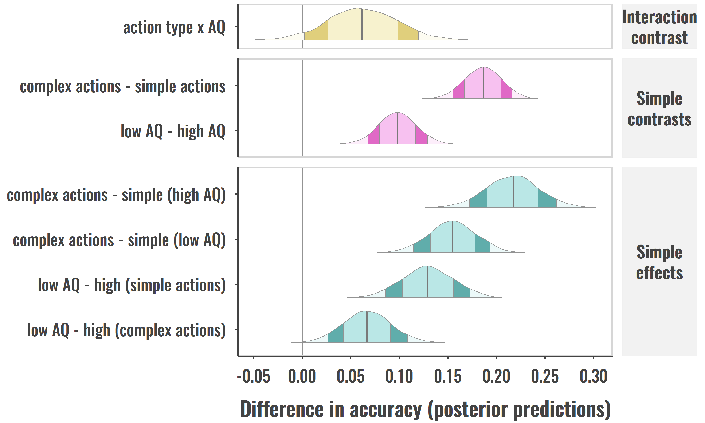

[](https://cran.r-project.org/package=ggdistribute)

# ggdistribute

ggplot2 extension for plotting distributions.



## Dependencies

- R: <https://www.r-project.org/>

A current R installation.

- `devtools` package: <https://www.rstudio.com/products/rpackages/devtools/>

So that you can install the GitHub contents as an R package. You can install the package by opening up RStudio or an R terminal and running:

```r
install.packages("devtools")
```

- Build tools: <http://cran.r-project.org/bin/windows/Rtools/>

For Windows users, you may be required to install Rtools first before you can use the `devtools` package. These are a set of build tools customized for building R packages (see `devtools` link for more details).


## How to install

Once `devtools` is installed, you’ll use the `install_github()` function
from the package to download and install the package from this GitHub
repository. Run the code below to download and install:

``` r
devtools::install_github("iamamutt/ggdistribute", dependencies=TRUE)
```

If successful, the package should now be installed. Load the package as you normally would any other package (see below). Repeat steps 2–3 if there are updates to the package or to reinstall on another computer. You should now be able to use the package materials and should see it in your packages tab if using RStudio.

``` r
library(ggdistribute)
```

## Viewing help documentation

Viewing the package welcome page:

``` r
package?ggdistribute
```

Viewing package information and a list of exported objects:

``` r
help(package = "ggdistribute")
# or
library(help="ggdistribute")
```

<!--
devtools::build(pkg = ".", path = "../tarballs", binary = FALSE, args = c("--md5"))
-->
